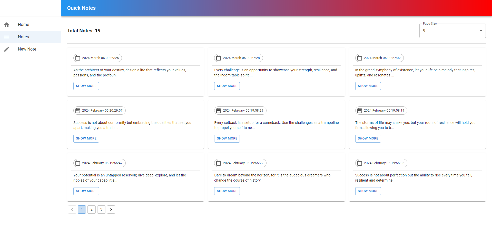

# SuperNote

SuperNote is a web application built with .NET 8, implementing Domain Driven Design and Clean Architecture. The project utilizes PostgreSQL as its database, and Entity Framework Core 8 for database interactions. Repository, Unit Of Work, and CQRS design patterns are employed, and Fast Endpoint is used for creating APIs. The client application is developed using React and Material UI.

## Features

- **Note Listing:** Display a paginated list of notes with dynamic pagination and page size.
- **Note Details:** View detailed information for each note.
- **Create New Note:** Create new notes through the application.

## Technologies Used

- **Backend:**
  - .NET 8
  - ASP.NET Core 8
  - Entity Framework Core 8
  - Fast Endpoint
  - PostgreSQL

- **Frontend:**
  - React
  - Material UI

## Getting Started

To run the project locally, follow these steps:

1. Clone the repository.
2. Set up the PostgreSQL database and update the connection string in the `appsettings.json` file.
3. Run the backend using Visual Studio or `dotnet run`.
4. Navigate to the `ClientApp` directory and run the frontend using `npm start`.

## Usage

1. Access the application in your web browser.
2. Explore the paginated list of notes.
3. Click on a note to view detailed information.
4. Create a new note using the provided functionality.

:hammer_and_wrench: **Contributing**

If you would like to contribute to the project, please follow these steps:

1. Fork the repository.
2. Create a new branch for your feature or bug fix.
3. Make your changes and submit a pull request.

:memo: **License**

This project is licensed under the [MIT License](LICENSE).

For any inquiries or feedback, feel free to contact me at [ArminYaghoubi1@gmail.com].
